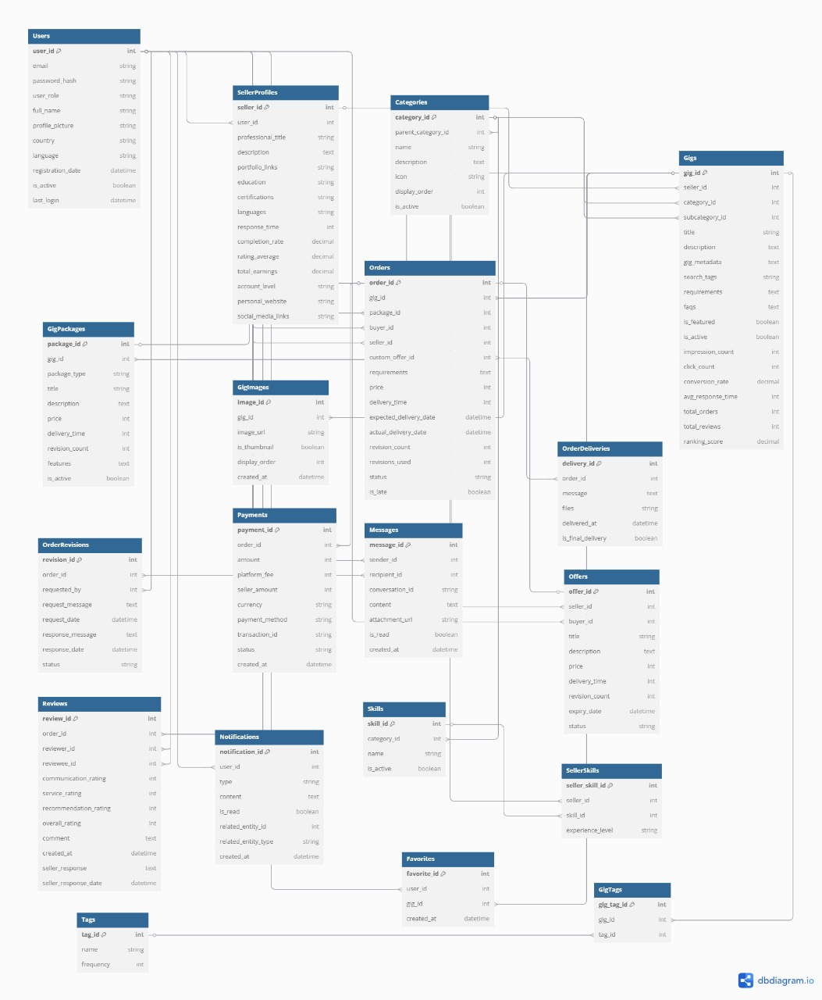

# CS130 Database Systems - Slate Project


A complete freelance marketplace platform demonstrating advanced database design and implementation using SQL Server, featuring 19+ normalized entities with comprehensive business logic.

---

## 👥 Group Members

| Name | Student ID | 
|------|------------|
| **Sajjad Amjad** | 241876 
| **Soban Farooq** | 241843
| **Muhammad Ahmed** | 241801

---

## 📋 Project Description

**Slate** is a comprehensive database system for a freelance marketplace that connects buyers with service providers. The system includes:

### 🎯 Core Features
- **User Management**: Buyers, Sellers, and Admin roles with comprehensive profiles
- **Gig Management**: Service listings with tiered packages (Basic/Standard/Premium)
- **Order Processing**: Complete order lifecycle with delivery and revision system
- **Review System**: Multi-criteria rating system with seller responses
- **Messaging**: Real-time communication between users
- **Payment Processing**: Escrow system with platform fees

### 🏗️ Technical Architecture
- **Database**: SQL Server with 19+ normalized tables (3NF compliant)
- **Backend API**: FastAPI with comprehensive REST endpoints
- **Advanced Features**: Triggers, Stored Procedures, Functions, Views, and Indexes
- **Testing**: Complete Swagger UI documentation with test scenarios

---

## 🗄️ Database Schema Overview

### Entity Count: **19 Tables**
1. **Users** - Base user information with role management
2. **SellerProfiles** - Extended seller information and metrics
3. **Categories** - Hierarchical service categories
4. **Gigs** - Service offerings with ranking algorithms
5. **GigPackages** - Three-tier pricing structure
6. **GigImages** - Media management for gigs
7. **Orders** - Transaction management
8. **OrderDeliveries** - Delivery tracking system
9. **OrderRevisions** - Revision request handling
10. **Reviews** - Multi-criteria review system
11. **Messages** - User communication system
12. **Offers** - Custom offer management
13. **Payments** - Financial transaction tracking
14. **Notifications** - System notification management
15. **Skills** - Skill taxonomy
16. **SellerSkills** - Seller-skill relationships
17. **Tags** - Content tagging system
18. **GigTags** - Gig-tag relationships
19. **Favorites** - User favorite gigs

### 🔗 Key Relationships
- **1:1** User → SellerProfile (Optional seller upgrade)
- **1:N** Seller → Gigs (Max 5 active gigs per seller)
- **1:3** Gig → GigPackages (Exactly 3 packages per gig)
- **M:N** Sellers ↔ Skills (Many-to-many through SellerSkills)
- **M:N** Gigs ↔ Tags (Many-to-many through GigTags)

### 📊 ER Diagram



---

## 🛠️ Setup Instructions

### Prerequisites
- **SQL Server** (Windows/macOS)
- **Python 3.10+** for backend API
- **Git** for version control

## 1. SQL Server Installation

### Windows Setup
1. **Download SQL Server**: 
   - Go to [Microsoft SQL Server Downloads](https://www.microsoft.com/en-us/sql-server/sql-server-downloads)
   - Download **SQL Server 2019 Developer** (free)
   
2. **Install SQL Server**:
   - Run the installer
   - Choose "Basic" installation
   - Accept default settings
   - Note the server name (usually `localhost` or `.\SQLEXPRESS`)
   
3. **Install SQL Server Management Studio (SSMS)**:
   - Download from [SSMS Download Page](https://docs.microsoft.com/en-us/sql/ssms/download-sql-server-management-studio-ssms)
   - Install with default settings

### macOS Setup
1. **Install via Docker** (Recommended):
   ```bash
   # Install Docker Desktop for Mac first
   # Then pull SQL Server container
   docker pull mcr.microsoft.com/mssql/server:2019-latest
   
   # Run SQL Server container
   docker run -e "ACCEPT_EULA=Y" -e "SA_PASSWORD=SlatePass1@" \
              -p 1433:1433 --name slate-sqlserver \
              -d mcr.microsoft.com/mssql/server:2019-latest
   ```

2. **Install SQL Query Tool**:
   - **Option A**: [Azure Data Studio](https://docs.microsoft.com/en-us/sql/azure-data-studio/download) (Free, cross-platform)
   - **Option B**: [TablePlus](https://tableplus.com/) (Paid, user-friendly)

## 2. Database Setup

### Phase 2: Create SlateDB2 (For Database Scripts)

#### Windows (Using SSMS):
1. Open **SQL Server Management Studio**
2. Connect to your SQL Server instance
3. Open each script file from `Phase2_Implementation/Database/` folder:
   - `SlateDB_Tables.sql`
   - `SlateDB_Triggers.sql`
   - `SlateDB_Procedures.sql`
   - `SlateDB_Functions.sql`
   - `SlateDB_Views.sql`
   - `SlateDB_Indexes.sql`
   - `SlateDB_SampleData&Scenario.sql`
4. Execute each script in order (F5 or Execute button)

#### macOS (Using Azure Data Studio):
1. Open **Azure Data Studio**
2. Connect to `localhost,1433` with:
   - **Username**: `sa`
   - **Password**: `SlatePass1@`
3. Open each script file from `Phase2_Implementation/Database/` folder
4. Copy and paste the content into a new query window
5. Execute each script in order (Ctrl+Shift+E or Run button)

### Phase 3: Create SlateDB (For Backend API)

For the backend API, we use a separate database. The API will automatically create this database when you run the initialization script.

## 3. Backend API Setup

```bash
# Navigate to backend directory
cd Phase3_Backend_API/backend/

# Create virtual environment
python -m venv venv

# Activate virtual environment
# On Windows:
venv\Scripts\activate
# On macOS/Linux:
source venv/bin/activate

# Install dependencies
pip install -r requirements.txt
```

### Initialize and Start API
```bash
# Initialize database (creates tables, triggers, procedures, etc.)
python scripts/init.py

# Start the API server
python run.py
```

## 4. Access Points
- **API Documentation**: http://127.0.0.1:8000/docs (Swagger UI)
- **Alternative Docs**: http://127.0.0.1:8000/redoc
- **Health Check**: http://127.0.0.1:8000/health

For detailed API testing instructions, see: [API Testing Guide](Phase3_Backend_API/API_Documentation.md)

---


### API Testing via Swagger
1. Open http://127.0.0.1:8000/docs
2. Complete API documentation available at [API Documentation](Phase3_Backend_API/API_Documentation.md)
3. Test complete user journey: Registration → Gig Creation → Order → Review

---

## 📊 Database Design Highlights

### Normalization Compliance
- **1NF**: All attributes are atomic, no repeating groups
- **2NF**: No partial dependencies on composite keys
- **3NF**: No transitive dependencies
- **BCNF**: Every determinant is a candidate key (where applicable)

**Detailed Normalization Analysis**: [Normalization Report](Phase1_Schema_Design/Normalization/Normalization_Report.md)

### Advanced Features
- **6 Triggers**: Business rule enforcement and automatic calculations
- **9 Stored Procedures**: Complex transaction handling
- **5 User-Defined Functions**: Reusable calculations
- **8 Views**: Simplified data access and reporting
- **7 Indexes**: Performance optimization

### Business Logic Implementation
- **Gig Ranking Algorithm**: Multi-factor scoring (40% seller performance + 35% gig performance + 25% content quality)
- **Payment Escrow System**: Secure payment holding and release
- **Revision Management**: Controlled revision workflow

---

## 📈 Performance Considerations

### Indexing Strategy
- **Primary Keys**: Clustered indexes on all tables
- **Foreign Keys**: Non-clustered indexes for join optimization
- **Search Fields**: Composite indexes on frequently queried columns
- **Ranking Fields**: Specialized indexes for sorting operations

### Query Optimization
- **Stored Procedures**: Pre-compiled execution plans
- **Views**: Simplified complex joins
- **Functions**: Reusable calculation logic
- **Triggers**: Real-time data maintenance

---

## 🔒 Security Features

- **Password Hashing**: bcrypt with salt
- **JWT Authentication**: Secure token-based auth
- **Role-Based Access**: Buyer/Seller/Admin permissions
- **SQL Injection Prevention**: Parameterized queries
- **Data Validation**: Comprehensive input validation

---

## 🎯 Learning Outcomes Demonstrated

1. **Database Design**: Professional ER modeling and normalization
2. **SQL Proficiency**: Advanced queries, procedures, triggers, and functions
3. **System Integration**: Backend API with database connectivity
4. **Business Logic**: Real-world marketplace operations
5. **Performance Optimization**: Indexing and query optimization
6. **Security Implementation**: Authentication and authorization
7. **Documentation**: Comprehensive technical documentation

---

## 🏆 Project Achievements

- ✅ **19+ Tables** (Exceeds 12 minimum requirement)
- ✅ **3NF Normalization** with detailed justification
- ✅ **Advanced SQL Features** (Triggers, Procedures, Functions, Views)
- ✅ **Comprehensive API** with 30+ endpoints
- ✅ **Complete Documentation** with setup guides
- ✅ **Real-World Business Logic** implementation

---
